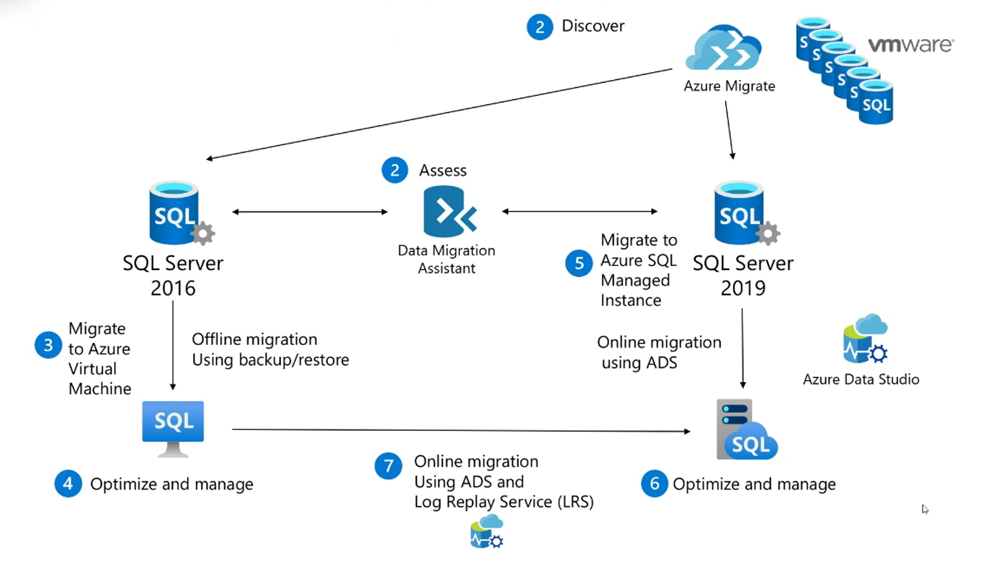
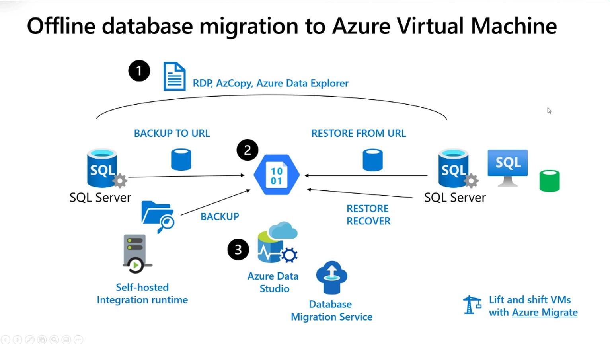
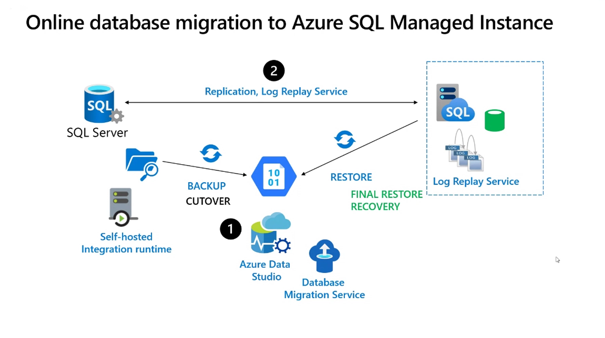

# Azure Database Migration

## Migration Scenarios
- discovery using azure migration (assessment)
- offline migration using backup/restore
- online migration using ADS(Azure Data Studio)
- online migration using ADS(Azure Data Studio) and LRS(Log Replay Service)

## Offline migration

## Online migration

## AdventureWorks sample databases
https://learn.microsoft.com/en-us/sql/samples/adventureworks-install-configure?view=sql-server-ver16&tabs=ssms

