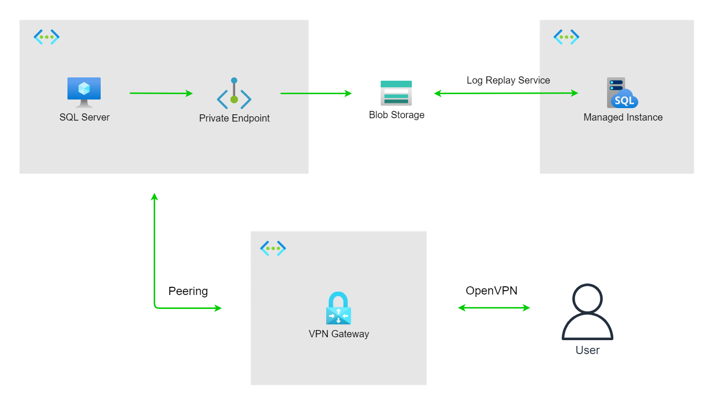

# Online migrate SQL server to SQL managed instance via Log Replay Service

## Architecture


## Steps
```
CREATE CREDENTIAL [Backup] WITH IDENTITY = '<myStorageAccount>'  
 ,SECRET = '<my_primary_access_key>'; 
GO

BACKUP DATABASE [AdventureWorks2012]
TO URL = 'https://<myStorageAccount>.blob.core.windows.net/<myContainer>/AdventureWorks2012.bak'
WITH CREDENTIAL = 'Backup'
     ,COMPRESSION
     ,STATS = 5
     ,CHECKSUM;
GO
```